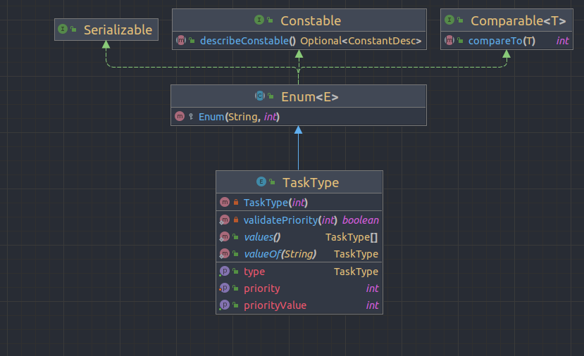
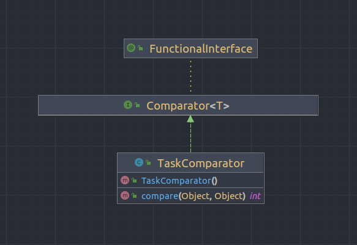
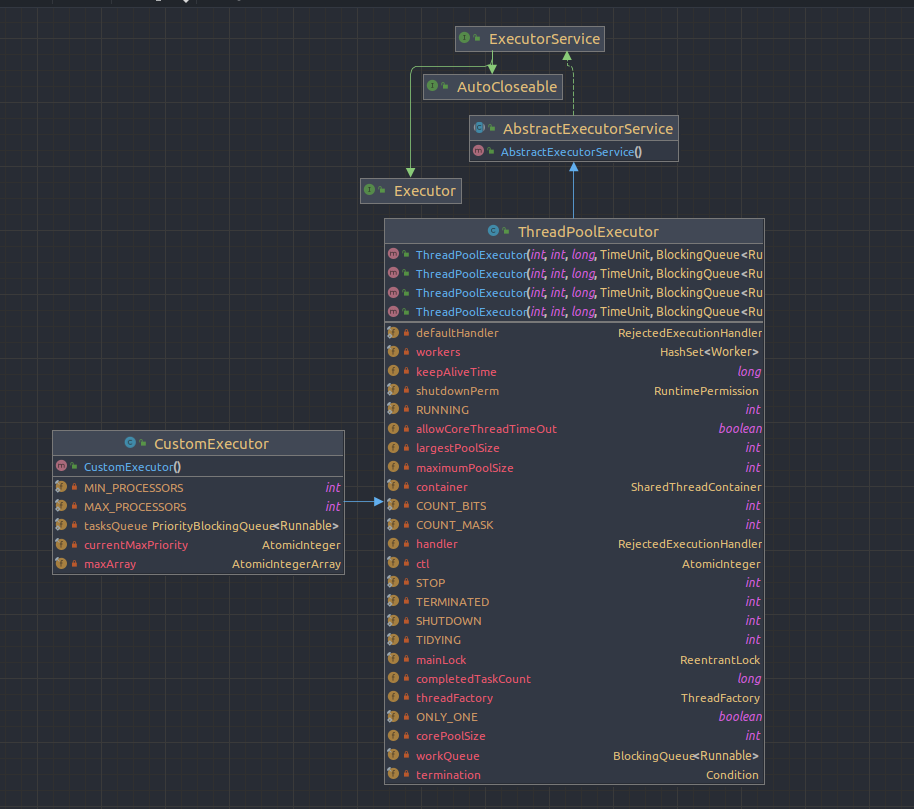

## _OOP - Ex 2 :_

### _Part 1 :_

In this part of the assignment, we will create several text files and calculate the total number of lines in them.

We will use three methods:
* The normal method without using threads.
* Using Threads.
* Using ThreadPool.

 The results of the running times of the functions are:  

  From the results of the running times, we can conclude the following:

When using a large number of files and a large number of lines in each file, the normal method is the least efficient and takes the longest time compared to the other methods. 

Additionally, with a smaller number of files and fewer lines per file, both the method, threads and ThreadPool compete for the best running times and no method consistently outperforms the others.

However, when the number of files and the number of lines in each file increase (over approximately 10,000), using threads performs better running times.
 
We tried to find why threads work better than threads pool.
We run the program again but this time with n/2 and n/10 threads in the threads pool(instead of 2000).
 Here are the results: 

 1000 threads in thread pool 

 200 threads in thread pool 

In the above examples, we can see that when the number of threads in the thread pool is smaller, the results of the thread pool are better.<t>
Creating threads is a costly operation, so when the number of threads in the thread pool is equal to the number of files we create, all the benefits of the thread pool are lost.

*CountLinesThread Class Uml Diagram:*

*CountLinesThreadPool Class Uml Diagram:*

### _Part 2 :_

In this part of the assignment, we create a new type of ThreadPool that represents an asynchronous task with a priority and type. 
The Task class represents an operation that can be run asynchronously and can return a value of any type.
The CustomExecutor class represents a new type of ThreadPool that supports a queue of tasks with priorities. 
The CustomExecutor creates a Task before its entry into the queue through the transfer of a Callable and an enum of type TaskType. 
The CustomExecutor executes the tasks according to their priorities.

*TaskType Class Uml Diagram:*

[TaskType Uml](TaskType.png)

*Task<V> Class Uml Diagram:*

*Task Comparator Class Uml Diagram:*

*Custom Executor Class Uml Diagram:*

